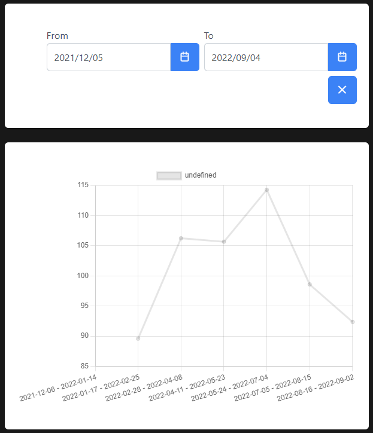

# analytics

A dashboard to display oil prices.
Data can be filtered by dates.



## Setup

Clone the project.

Run in termital to install all packages:
`npm install`

To start development mode:
`npm run dev`

After that fro terminal open Local environment link

## Filters

Filter accepts a range of dates. If too many items fetched they will be __grouped__.

## Tech used

- VueJs 3
- [Pinia](https://pinia.vuejs.org/) - for state management
- [PrimeVue](https://www.primefaces.org/) - UI framework
- [Axios](https://www.npmjs.com/package/axios) - http requests handling
- [vue-chart-3](https://vue-chart-3.netlify.app/) - for line chart

## Data

Data taken from [kapsarc](https://datasource.kapsarc.org/)

## Possible improvements

The app can be improved further. Here are some parts to improve
- Write unit tests
- Improve typization. Types set not in all places
- Empisize more accessibility

## Vue docs
---
## Recommended IDE Setup

[VSCode](https://code.visualstudio.com/) + [Volar](https://marketplace.visualstudio.com/items?itemName=Vue.volar) (and disable Vetur) + [TypeScript Vue Plugin (Volar)](https://marketplace.visualstudio.com/items?itemName=Vue.vscode-typescript-vue-plugin).

## Type Support for `.vue` Imports in TS

TypeScript cannot handle type information for `.vue` imports by default, so we replace the `tsc` CLI with `vue-tsc` for type checking. In editors, we need [TypeScript Vue Plugin (Volar)](https://marketplace.visualstudio.com/items?itemName=Vue.vscode-typescript-vue-plugin) to make the TypeScript language service aware of `.vue` types.

If the standalone TypeScript plugin doesn't feel fast enough to you, Volar has also implemented a [Take Over Mode](https://github.com/johnsoncodehk/volar/discussions/471#discussioncomment-1361669) that is more performant. You can enable it by the following steps:

1. Disable the built-in TypeScript Extension
    1) Run `Extensions: Show Built-in Extensions` from VSCode's command palette
    2) Find `TypeScript and JavaScript Language Features`, right click and select `Disable (Workspace)`
2. Reload the VSCode window by running `Developer: Reload Window` from the command palette.

## Customize configuration

See [Vite Configuration Reference](https://vitejs.dev/config/).

## Project Setup

```sh
npm install
```

### Compile and Hot-Reload for Development

```sh
npm run dev
```

### Type-Check, Compile and Minify for Production

```sh
npm run build
```

### Run Unit Tests with [Vitest](https://vitest.dev/)

```sh
npm run test:unit
```

### Run End-to-End Tests with [Cypress](https://www.cypress.io/)

```sh
npm run build
npm run test:e2e # or `npm run test:e2e:ci` for headless testing
```

### Lint with [ESLint](https://eslint.org/)

```sh
npm run lint
```
